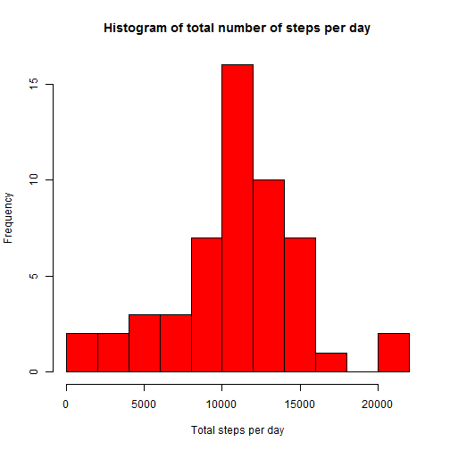
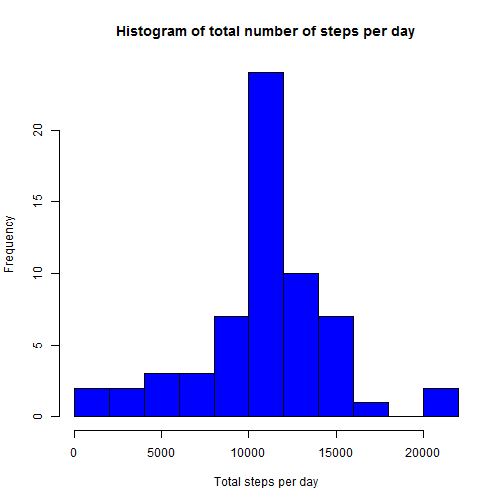
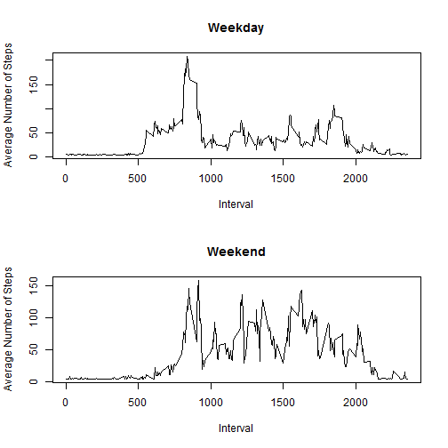

## Loading and preprocessing the data
Firstly we load in the data from the working directory, create a new date variable that holds the POSIX formatted date and then create a second dataset that excludes NAs.

```r
Data <- read.csv("./activity.csv")
Data$FDate <- strptime(Data$date, format = "%Y-%m-%d")
DataExNAs <- Data[!is.na(Data$steps), ]
```


## What is mean total number of steps taken per day?
Use tapply function to sum the number of steps taken per day then plot a histogram of this.

```r
StepsPerDay <- tapply(DataExNAs$steps, DataExNAs$date, sum)
hist(StepsPerDay, breaks = 8, col = "red", main = "Histogram of total number of steps per day", 
    xlab = "Total steps per day")
```

 


Calculate the mean and median of steps per day

```r
MEAN <- mean(StepsPerDay, na.rm = TRUE)
MEAN
```

```
## [1] 10766
```

```r
MEDIAN <- median(StepsPerDay, na.rm = TRUE)
MEDIAN
```

```
## [1] 10765
```

The mean was 1.0766 &times; 10<sup>4</sup>, and the median was 10765.


## What is the average daily activity pattern?
We want to plot the number of steps taken in each interval, averaged across all days.

```r
StepsInterval <- tapply(DataExNAs$steps, DataExNAs$interval, mean)
plot(rownames(StepsInterval), StepsInterval, type = "l", main = "Average Number of Steps by Interval", 
    xlab = "Interval", ylab = "Average Number of Steps")
```

 

Now, let's see which interval has the largest average number of steps

```r
maxSteps <- labels(StepsInterval[StepsInterval == max(StepsInterval)])
```

The largest average number of steps happens at 835.

## Imputing missing values
How many missing values are there?

```r
NumMissing <- sum(is.na(Data$steps))
```


There are 2304 missing values in this dataset. I will replace the missing values with the average number of steps across the entire dataset (certainly not the most sophisticated method, but aiming for code that should be easier to follow).

```r
DataImputed <- Data
DataImputed[is.na(DataImputed$steps), 1] <- mean(DataImputed$steps, na.rm = T)
```


Now draw the histrogram and report the mean and median values as before.

```r
StepsPerDayImp <- tapply(DataImputed$steps, DataImputed$date, sum)
hist(StepsPerDayImp, breaks = 8, col = "blue", main = "Histogram of total number of steps per day", 
    xlab = "Total steps per day")
```

 


Get the new mean and median values

```r
MEANImp <- mean(StepsPerDayImp, na.rm = TRUE)
MEANImp
```

```
## [1] 10766
```

```r
MEDIANImp <- median(StepsPerDayImp, na.rm = TRUE)
MEDIANImp
```

```
## [1] 10766
```

The mean was 1.0766 &times; 10<sup>4</sup>, and the median was 1.0766 &times; 10<sup>4</sup>.

## Are there differences in activity patterns between weekdays and weekends?
Set up a new variable for weekday vs weekend.

```r
DataImputed$DayType <- "weekday"
DataImputed[weekdays(DataImputed$FDate) == "Saturday" | weekdays(DataImputed$FDate) == 
    "Sunday", 5] <- "weekend"
```


Finally, lets finish by creating a panel plot of the average number of steps by interval comparing the weekdays vs the weekends

```r
WeekDayData <- DataImputed[DataImputed$DayType == "weekday", ]
WeekendData <- DataImputed[DataImputed$DayType == "weekend", ]
StepsIntervalWeekday <- tapply(WeekDayData$steps, WeekDayData$interval, mean)
StepsIntervalWeekend <- tapply(WeekendData$steps, WeekendData$interval, mean)
par(mfrow = c(2, 1))
plot(rownames(StepsIntervalWeekday), StepsIntervalWeekday, type = "l", main = "Weekday", 
    xlab = "Interval", ylab = "Average Number of Steps")
plot(rownames(StepsIntervalWeekend), StepsIntervalWeekend, type = "l", main = "Weekend", 
    xlab = "Interval", ylab = "Average Number of Steps")
```

 


